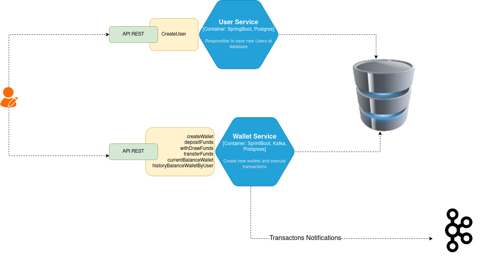
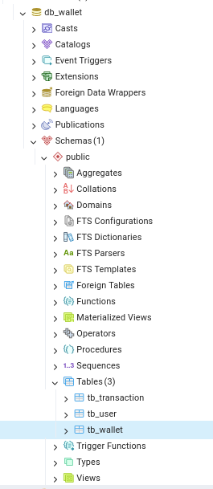
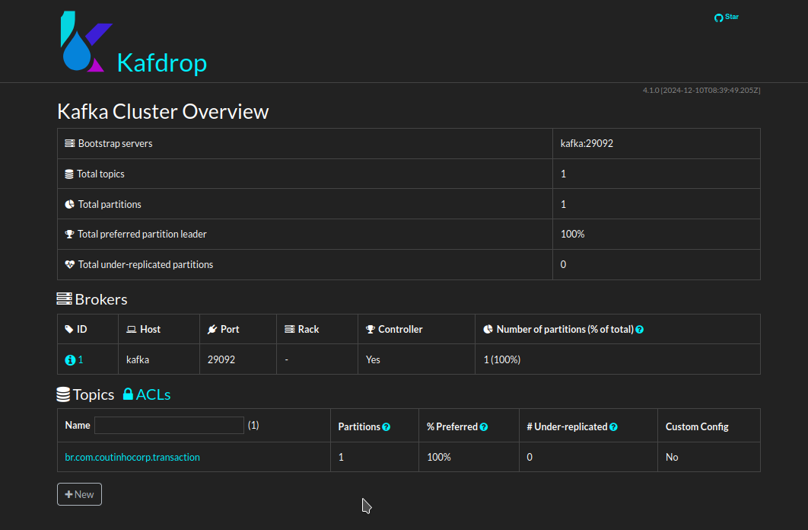

# Microservices to create new wallets and transactions

## Architecture



# Features
## 1. Create new users
###### 
To create new users the "users" endpoint must be called passing **name**, **email** and **numberDocumentUser**
curl --request POST \
  --url 'http://localhost:8081/api/wallet/v1/users?=' \
  --header 'Content-Type: application/json' \
  --data '{
"name":"Claudinho e Buchecha Santos",
"email":"buchecha@email.com",
 "numberDocumentUser":"987654321"
}'
## 2. Create new Wallets
###### 

To create new wallets, you must have previously created a user to be linked as the wallet owner. cURL example:
curl --request POST \
  --url 'http://localhost:8082/api/wallet/v1/createWallet?=' \
  --header 'Content-Type: application/json' \
  --data '{
"balance":1000.0,
"isActive": true,
 "walletType":"PF",
"numberDocumentUser":"123456789"
}'

## 3. Deposit Funds
###### 
Once created and linked to an owner, every wallet can start performing operations such as receiving new deposits of funds destined for the owner.
curl --request POST \
  --url 'http://localhost:8082/api/wallet/v1/depositFunds?=' \
  --header 'Content-Type: application/json' \
  --data '{
"amount":650.0,
"numberDocumentUser":"123456789"
}'

## 4. With draw funds
###### 
Any wallet that has funds can withdraw any amount as long as the wallet has the desired amount for withdrawal.
curl --request POST \
  --url 'http://localhost:8082/api/wallet/v1/withDrawFunds?=' \
  --header 'Content-Type: application/json' \
  --data '{
"amount":7350.0,
"numberDocumentUser":"987654321"
}'

## 5. Transfer funds
###### 
Any wallet with funds can transfer amounts to another wallet, as long as it provides the document of the owner of the destination wallet.
curl --request POST \
  --url 'http://localhost:8082/api/wallet/v1/transferFunds?=' \
  --header 'Content-Type: application/json' \
  --data '{
"amount":90750.0,
"numberDocumentUserReceiver":"123456789",
"numberDocumentUserSender":"987654321"
}'

## 6. Get wallet balance
###### 
By providing the wallet owner's document, it is possible to check the balance.
curl --request GET \
  --url 'http://localhost:8082/api/wallet/v1/currentBalanceWallet?id=123456789' \
  --header 'Content-Type: application/json'

## 7. History balance transaction 
######  
Returns all transactions and amounts made to accounts over time. All transactions are categorized as **deposit**, **transfer** or **withdrawal**
curl --request GET \
  --url 'http://localhost:8082/api/wallet/v1/historyBalanceWalletByUser?id=123456789' \
  --header 'Content-Type: application/json'


All transactions are recorded in a database and made available after execution in a **Kafka topic** so that future microservices can notify wallet owners about movements that have occurred, whether by email, SMS, etc.

# How to run

## Required
* Java 21
* Docker Composer
* IDE to compile java code

## Steps 
* Need to checkout the project locally
* Enter the project directory and run the command to upload the kafka and postgress docker images
```sh
  docker network create local-network
  docker-compose -f docker-compose.yml up
  ```

Wait for containers to upload, after they are successfully uploaded the kafdrop and postgres pgAdmin UI will be at the following URLs:

```sh
  http://localhost:16543
  docker-compose -f docker-compose.yml up
  http://localhost:19000/
  ```

* Perform local build of the project, all kafka tables and topics will be created automatically after execution.
Tables:
```sh
  wallet.tb_user
  wallet.tb_wallet
  wallet.tb_transaction
  ```
  

Kafka Topic:
```sh
 br.com.coutinhocorp.transaction
  ```

## All calls to the endpoints are contained in the *apiRequests* file and can be imported via *Insomnia*, client for executing HTTP calls
